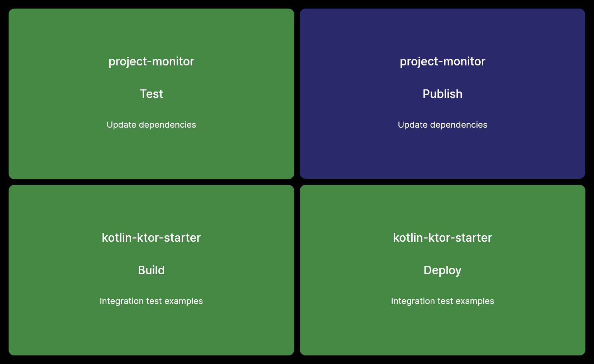

# initialMonitor[]

This blog post was originally posted [on the initialCapacity website](https://initialcapacity.io/initial-monitor)

## A desktop project monitor in F#.

### Key Takeaways

We are sharing the [source code to our custom project monitor](https://github.com/initialcapacity/project-monitor).
This is a great way to get started with [programming in F#](https://fsharp.org/) and grasping stateful application architecture.

## Introduction

We recently built [our own project monitor](https://github.com/initialcapacity/project-monitor) to keep
track of the status of our continuous integration builds. We’ve built a few over the past decade or so and
decided to take a slightly different approach this time by building a desktop application in [F#](https://fsharp.org/).

The application is running on a local computer connected to a 55” TV monitor in our office. The machine is
an Intel NUC running [Pop!_OS](https://pop.system76.com/).
So, that’s right, the app was written in a functional first language, built on Windows, deployed on Linux.

We decided to go for a cross-platform desktop application to make the app easier to deploy and configure on
individual, commodity machines that were dormant and likely laying around our office collecting dust. Since
it’s easy to compile [F#](https://fsharp.org/) for any platform we could have deployed the app to a
Raspberry PI or a Mac Mini. In addition, we’re not paying for any hosting costs related to configuring or
serving up a web application.


A screenshot of the monitor.

## Configuration

Running the application requires you to pass in the path to a JSON configuration file. The JSON file should
follow the structure [from the provided sample](https://github.com/initialcapacity/project-monitor/blob/main/DesktopApp/res/ConfigSample.json).
We could have spent more time building a fancy UI but in the spirit of starting simple we
favored being able to ship a binary alongside a JSON file - which is much more convenient for our use case.

## Technology Stack

Here is a quick look at the technologies we used to build the application -

 * [.NET 5](https://dotnet.microsoft.com/download/dotnet/5.0)
 * [JetBrains Rider](https://www.jetbrains.com/rider/)
 * or [Visual Studio Code](https://code.visualstudio.com/) + [Ionide](https://ionide.io/)

## Software Design

As previously mentioned, the application is developed with the 
[cross-platform desktop application framework AvaloniaUI](https://avaloniaui.net/) and its 
[F# companion library Avalonia.FuncUI](https://avaloniacommunity.github.io/Avalonia.FuncUI.Docs/).

The application launches a single window which runs a small [Elm-ish application](https://elmish.github.io/elmish/),
implementing a **Unidirectional Data Flow architecture**. This architecture was originally introduced by 
the [Elm programming suite](https://guide.elm-lang.org/architecture/) and popularized by [Redux](https://redux.js.org/).

When building stateful applications like desktop applications, native mobile applications, or web frontend
applications, it becomes increasingly important to understand how to deal with state. We have found this
paradigm shift new to the majority of companies that we’ve worked with over the years. Unidirectional data
flow is one of the cleanest ways of thinking about UI and its state. The architecture relies heavily on the
UI being represented by pure functions and not thinking about how the UI changes overtime - but how
individual areas of the application should render given the current state.

State is changed through dispatching events and is decoupled from the rendering of the view itself.

## Adding layouts for more projects

The application supports displaying 1 to 6 projects at the time this article is published. To support more
projects, we can change the [Layout module](https://github.com/initialcapacity/project-monitor/blob/main/DesktopApp/src/Layout.fs)
to support different sized grids. Understanding [AvaloniaUI's Grid](https://docs.avaloniaui.net/docs/controls/grid)
is a great starting point to better understand the layout module.

## Publishing

While the GitHub Action is already configured, publishing for **Linux**, **MacOS**
or **Windows** is a one line command:

```
dotnet publish -c release -r <release-identifier>
```

Release identifiers can be, for example: `osx-x64`, `linux-x64`, `win10-x64` and they can be targeted
from any of these operating systems, effectively cross compiling the resulting binary.

## Summary

That’s a wrap! We hope you enjoyed the article.

&copy; Initial Capacity, Inc. All rights reserved.
