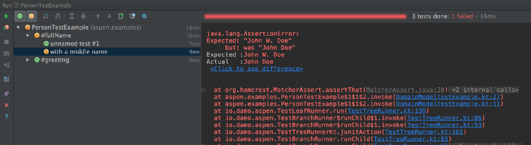

# Kotlin testing with Aspen and Aspen Spring

TL;DR — Aspen 2.0 is out, check it out:
[https://github.com/dam5s/aspen](https://github.com/dam5s/aspen)

## How I got into Kotlin

I started looking at Kotlin around release M9, it was quite a few months before
it was released as 1.0, but it was already very usable. Kotlin promised easy
integration with your Java code, running on the Java 6 VM and a lot of features
that make the code a lot nicer to work with.

Having worked with Java for a couple years with some of our clients, I was
really excited to get rid of the verbosity and keep the things I like in Java: a
good build system (Gradle), easy to build modular applications, a decent type
system (that gets improved a lot by Kotlin), and a huge ecosystem with mature
libraries.

Our first production project for a client was using Kotlin M12 for an Android
application. The experience was great, the client developers were former C#
developers. They loved the language, and despite a few quirks here and there, we
shipped it by the time Kotlin M13 was released. A few weeks later, Kotlin 1.0
was released.

Now I have been through a couple more projects with Kotlin and I would advise
any Java developer out there to look into it. It’s easy to get started with, and
you can introduce it in your existing projects without pain.

## Why I decided to create Aspen

I have been really enjoying the simplicity of Java unit tests using JUnit. Its
simplicity encourages you to write simple tests that are easy to read. Using
only one “@Before” annotated function encourages you to make each test readable
from top to bottom without having to jump around.

The only thing I really miss from my Ruby days was being able to write a short
sentence to describe my test. With JUnit, I would name tests following this
pattern:

```java
public void testMyFunction              // testing the happy path
public void testMyFunction_WhenInput... // testing another context
```

Some developers would also describe the expected outcome in the function name. I
do not do that because I want to encourage developers in my team to name
variables and write assertions that talk for themselves. Also I do not want to
have yet another comment that can get out of sync easily.

Kotlin allowing to create type safe DSLs, I decided to write a DSL for testing.
It is inspired by RSpec and Spek, but it is a lot simplified and easy to extend
with your own DSL if you would like.

## Here comes Aspen

An Aspen test looks like this:

```kotlin
class PersonTestExample : Test({
    describe("#fullName") {
        test {
            val person = buildPerson(
                firstName = "Jane",
                lastName = "Doe"
            )
            assertThat(person.fullName(), equalTo("Jane Doe"))
        }

        test("with a middle name") {
            val person = buildPerson(
                firstName = "John",
                middleName = "William",
                lastName = "Doe"
            )
            assertThat(person.fullName(), equalTo("John W. Doe"))
        }
    }

    describe("#greeting") {
        test {
            val person = buildPerson(
                firstName = "Jane",
                lastName = "Doe"
            )
            assertThat(person.greeting(), equalTo("Greetings Jane!"))
        }
    }
})
```



With the help of a few colleagues (Joe, Jack, Mike G, Travis, Nathan, Alex…
thanks guys!), we wrote Aspen. It’s a really simple DSL that makes unit tests
easier to organize, and it’s built on top of JUnit.

## Spring Integration

A big requirement for us to use a testing framework: it has to work with Spring.
Most of the tests we write with Spring are pure unit tests, so that already just
works. But we also have a few tests that require us to use the Spring test
runner in order to spin up the server and run some higher level tests.

Thankfully the Spring team has done a great job at abstracting the way the
Spring runner work. It’s been very easy to write our own runner for Spring that
reuses the code by the Spring team.

A test with Aspen Spring can look like this:

```kotlin
@RunWith(SpringTestTreeRunner::class)
@SpringApplicationConfiguration(ExampleApplication::class)
@WebIntegrationTest("server.port:0")
class SpringApplicationTestExample : Test({

  val message: String = inject("myMessage")
  val port = injectValue("local.server.port", Int::class)
  val client = OkHttpClient()

  test("GET /hello") {
    val request = Request.Builder()
      .url("http://localhost:$port/hello")
      .build()
    val response = client.newCall(request).execute()

    val body = response.body().string()

    assertThat(body, equalTo("""{"hello":"world"}"""))
    assertThat(body, equalTo("""{"hello":"$message"}"""))
  }

  test("GET /world") {
    //...
  }
})
```

## Getting Aspen and Aspen Spring

Instructions for setting up Aspen and Aspen Spring are
on [my Github](https://github.com/dam5s/aspen).
