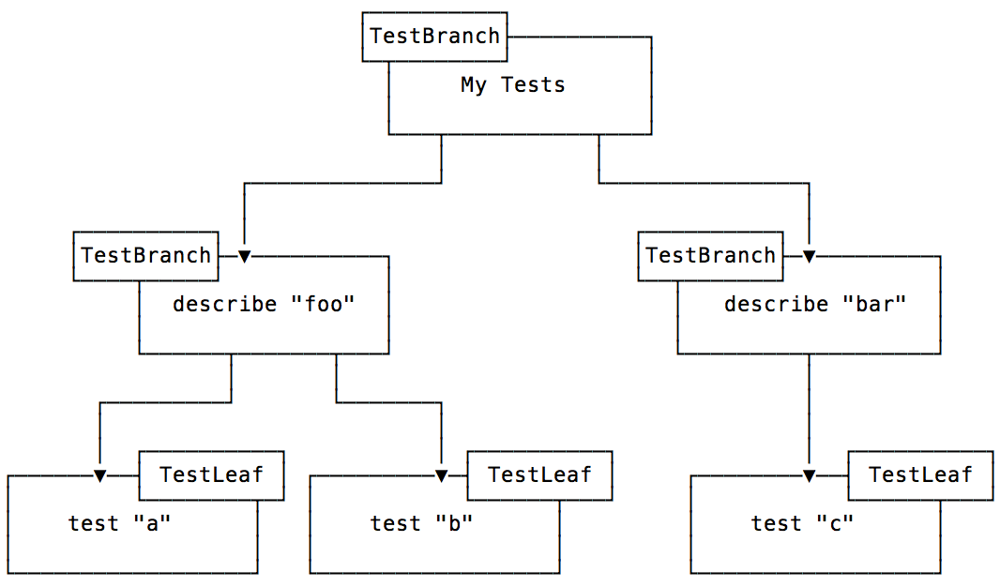

# Testing Kotlin with a custom DSL for Aspen


## Where that feature came from

When I started working on Aspen, I was focusing on only a few things: I want an
easy way to regroup my tests for a given function, and I want to be able to name
my tests with a simple sentence but I don’t want to have to name my tests. That
lead to version 1.0.

Then came Spring integration, version 1.1. Then we started talking to more
people to see what they wanted, and it became quickly obvious that a very simple
DSL was not going to be enough for some. So I started working on another DSL
that would allow nesting of the tree structure, like rSpec does. This lead to
version 1.2.

During the creation of that second DSL, I tried to figure out what was the right
abstraction for it. It became obvious that we are building a tree structure and
running that. So now I’m going to show you how to create your own DSL that
builds a tree structure for Aspen.

## Building a TestTree

The goal of the DSL is to build a TestTree that can then be run by the
TestTreeRunner from Aspen. For example, with the built-in DSL, the following
code…

```kotlin
class MyTests: Test({

    describe("foo") {
        test("a") {

        }

        test("b") {

        }
    }

    describe("bar") {
        test("c") {

        }
    }
})
```

…would build the following structure.



## The TestTree Interface

An Aspen DSL implements the TestTree Interface.

```kotlin
interface TestTree {
    fun readTestBody()
    fun getRoot(): TestBranch
}
```

The `readTestBody` function is the one that is supposed to evaluate the body of
the tests and build the tree structure, thus making the root available. It is
invoked at a particular time in the SpringTestTreeRunner for instance, the
default TestTreeRunner invokes it as soon as it needs to browse the tree.

The `getRoot` function is more obvious, it returns the first branch of your
Tree.

A `TestBranch` has `children` and optional `before` and `after` blocks. Its
children can be of type `TestBranch` or `TestLeaf`. A `TestLeaf` represents an
actual test, it has a block of code to execute and can have a focused flag.

All the code for the `TestTree` is in a single file:
[https://github.com/dam5s/aspen/blob/master/libraries/aspen/src/main/kotlin/io/damo/aspen/TestTree.kt](https://github.com/dam5s/aspen/blob/master/libraries/aspen/src/main/kotlin/io/damo/aspen/TestTree.kt)

## The Test class

Let’s start with the easy part, implementing the TestTree interface:

```kotlin
@RunWith(TestTreeRunner::class)
open class Test : TestTree {
    private val root = TestBranch.createRoot()
    private val body: Test.() -> Unit

    constructor(body: Test.() -> Unit) {
        this.body = body
    }

    override fun getRoot() = root

    override fun readTestBody() {
        this.body.invoke(this)
    }
}
```

This is an open class that is run with the `TestTreeRunner` and implements
`TestTree`. The root is created with `TestBranch.createRoot`, creating a branch
without parent, without name… The body is an extension function for the class
itself, this is the block of code that will contain your tests and build the
`TestTree` structure, it is evaluated in the `readTestBody` function.

Now you can start adding some functions that will help you build the tree.

This will allow specifying the before and after block:

```kotlin
fun before(block: () -> Unit) {
    root.before = block
}

fun after(block: () -> Unit) {
    root.after = block
}
```

This will add a test at the root level:

```kotlin
fun test(name: Any = "unnamed test", block: () -> Unit) {
    root.addChildLeaf(name.toString(), block)
}
```

Now in order to add branches that do not allow nesting, we have to create a
function that will take an extension function for a different type. If it was
for the same type, then we would be able to call that same function over and
over.

```kotlin
fun describe(name: Any, block: TestDescription.() -> Unit) {
    val newBranch = root.addChildBranch(name.toString())
    TestDescription(newBranch).block()
}
```

The `TestDescription` only allows adding tests:

```kotlin
class TestDescription(private val branch: TestBranch) {
    fun test(name: String = "unnamed test", block: () -> Unit) {
        branch.addChildLeaf(name, block)
    }
}
```

And that’s it! From that point you can start making your DSL even smarter.

For instance, I have been working on making a DSL for nicer table based tests.
You can see its
[first implementation on Github](https://github.com/dam5s/aspen/blob/table-test-spike/libraries/aspen/src/main/kotlin/io/damo/aspen/Test.kt).
It would allow for writing a test like this:

```kotlin
class MathTest : Test({

    class MaxData(context: String, val a: Int, val b: Int, val c: Int)
        : TestData(context)

    val testData = listOf(
        MaxData("when equal", 2, 2, 2),
        MaxData("when a is greater", 3, 1, 3),
        MaxData("when b is greater", 3, 4, 4)
    )

    tableTest(testData) {
        test {
            assertThat(Math.max(a, b), equalTo(c))
        }
    }
})
```

But it is still a work in progress, as I still need to figure out exactly how I
want my test to look like (that test block does not look useful for instance).

I hope this convinced you that it’s very simple to write your own type safe DSL
for testing with Aspen. Let me know what you think about it!
